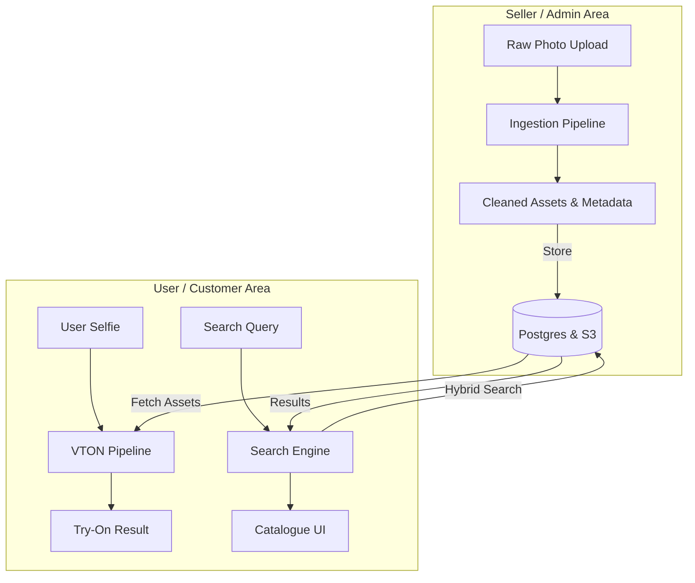

# Virtual Try-On (VTON) Application: Master Plan

This document outlines the complete architecture for the Virtual Try-On application. It integrates the **Garment Ingestion Pipeline** (for catalog management) and the **SOTA 2D VTON Pipeline** (for the user experience).

## 1. System Architecture Overview

The system consists of two main workflows that meet in the middle (the Database/Storage).

## 2. Core Modules

We have broken down the system into specific detailed modules:

*   **[Ingestion Pipeline](./ingestion_module.md)**: Details on Background Removal (Rembg) and VLM Metadata extraction.
*   **[Search & Discovery Engine](./search_module.md)**: Hybrid Search (Semantic + Faceted) using pgvector and JSONB.
*   **[VTON Core Pipeline](./vton_core_module.md)**: Details on IDM-VTON, DensePose, and the generative workflow.
*   **[Backend Architecture](./backend_architecture.md)**: FastAPI, Celery Task Queues, and Database schema.
*   **[Frontend Architecture](./frontend_architecture.md)**: Next.js, Framer Motion, and UI/UX design.

## 3. Implementation Roadmap

### Phase 1: Foundation
*   [ ] Set up Next.js Front end + FastAPI Backend.
*   [ ] Implement "Ingestion Pipeline" (Upload -> Remove BG -> Save to S3).

### Phase 2: The Core VTON
*   [ ] Set up Docker container with IDM-VTON and dependencies.
*   [ ] Create the "Try-On" API endpoint (User Image + Garment ID -> Result Image).
*   [ ] Connect Frontend to this API.

### Phase 3: Polish & VLM
*   [ ] Add the VLM Metadata extraction.
*   [ ] Polish the UI (Loading skeletons, animations).
*   [ ] Optimize inference speed (Torch.compile, fp16).
